# Room Reservation application for Academic Hospital
Project for Software Engineering course using .NET with Windows Forms and MySQL database.

# **POLITECHNIKA WARSZAWSKA** 

**WYDZIAŁ MECHATRONIKI** 

**INŻYNIERIA OPROGRAMOWANIA** 

**Dokumentacja** 

**do projektu** 

***“System rezerwacji sal dla szpitala akademickiego”*** 

Grupa IP 

Michał Foltys - business analisys

Przemysław Mazur - system project

Patryk Sulej - app development

Paweł Manastyrski  - app development

Spis treści 

1. [**Etap I – notatka oraz diagram otoczenia biznesowego ............................. 3**](#_page2_x68.00_y71.00)
1. [Notatka ze spotkania .................................................................................................................... 3 ](#_page2_x68.00_y93.00)
1. [Kosztorys ...................................................................................................................................... 4 ](#_page3_x68.00_y417.00)
3. [Diagram otoczenia biznesowego ................................................................................................. 5 ](#_page4_x68.00_y71.00)
4. [Aktorzy ......................................................................................................................................... 6 ](#_page5_x68.00_y71.00)
5. [Wymagania formalne ................................................................................................................... 6 ](#_page5_x68.00_y290.00)
2. [**Etap II – diagram przypadków użycia, scenariusze i projekt GUI ............... 7**](#_page6_x68.00_y71.00)
1. [Diagram przypadków użycia......................................................................................................... 7 ](#_page6_x68.00_y93.00)
1. [Scenariusze ................................................................................................................................... 8 ](#_page7_x68.00_y71.00)
3. [Diagram GUI ............................................................................................................................... 18 ](#_page17_x68.00_y71.00)
3. [**Etap III – diagram klas i diagram sekwencji ............................................ 19**](#_page18_x68.00_y71.00)
1. [Diagram klas ............................................................................................................................... 19 ](#_page18_x68.00_y93.00)
1. [Diagramy sekwencji.................................................................................................................... 19 ](#_page18_x68.00_y343.00)
4. [**Etap IV – implementacja sekwencji ........................................................ 22**](#_page21_x68.00_y649.00)
1. Etap I – notatka oraz diagram otoczenia biznesowego 
1. Notatka ze spotkania 

**Informacje ogólne o projekcie** 

Przedmiotem niniejszego zamówienia jest zaprojektowanie, wdrożenie oraz utrzymanie na serwerach przez okres wynikający z informacji podanych w ofercie, systemu informatycznego wspierającego w rezerwowaniu oraz zarządzaniu salami Szpitala Akademickiego. Obsługa programu odbywa się za pomocą komputera PC. Zapewniamy użytkownikom możliwość logowania z różnym poziomem autoryzacji. Szpital posiada wewnętrzny system informatyczny, z którego czerpane będą informacje o zatrudnionych lekarzach, system dodatkowo zapewni możliwość ręcznego dodawania lekarzy kontraktowych.  

System informatyczny ma zapewniać monitorowanie i zarządzanie wszystkimi salami w budynkach szpitalnych. Sale rozróżniane są na sale do spotkań, sale chorych, sale pokazowe oraz sale operacyjne. Każda sala posiada swoje parametry, w postaci ilości łóżek, dostępnego sprzętu itp. Po każdej z rezerwacji sal wymagana jest ich dezynfekcja zgodnie z obostrzeniami związanymi z pandemią wirusa COVID-19, co wiąże się z 15-minutową przerwą między kolejnymi rezerwacjami.  

Program zapewnia monitorowanie i przechowywanie informacji o przepływie osób w rezerwowanych salach. Dzięki temu możliwe jest wyświetlenie historii kontaktów wybranej przez użytkownika osoby z innymi ludźmi, co może okazać się bardzo pomocne w przypadku wykrycia choroby zakaźnej.  

Oprogramowanie ma również zawierać elementy kontroli operacji w nim wykonywanych, aby uniemożliwić realizację czynności fizycznie niemożliwych, np. przeniesienia pacjenta podłączonego do specjalistycznego sprzętu do sali gdzie takiego sprzętu brakuje. Kontrola obejmuje również zajętość sal oraz topografię szpitala. Dodatkową funkcją realizowaną przez program to informowanie imienne studentów mających zajęcia w szpitalu, w jakiej sali i o której godzinie powinni stawić się na zajęcia. To rozwiązanie ogranicza niepotrzebne przemieszczanie się studentów po szpitalu oraz ułatwia komunikację. 

**Opis dotychczasowego procesu rezerwacji sal** 

Szpital akademicki składa się z kilku budynków. W każdym z nich znajduje się jeden lub więcej oddziałów szpitalnych.  Każdy z oddziałów ma swoje sale, które zaklasyfikować można jako sale do spotkań, sale pokazowe, sale chorych oraz izolatki. Proces rezerwacji poszczególnych sal został przedstawiony poniżej:  

**Rezerwacja sal spotkań** 

Osoba chcąca zarezerwować salę winna udać się do zarządcy budynku, w którym znajduje się dana sala. Zarządca sprawdza, czy sala w danym momencie jest wolna. Jeśli tak, zezwala na spotkanie. Jeśli nie, proponuje inne miejsce na spotkanie. 

**Rezerwacja Sali pokazowej** 

Sale pokazowe służą do spotkań studentów z chorymi w obecności doświadczonego lekarza. Rezerwacja takiej sali odbywa się poprzez administrację budynku.  Sprawdzana jest lista dostępnych sal a następnie przydzielana jest sala na podstawie profilu spotkania. 

**Rezerwacja miejsca w sali chorych**

Pacjent, który potrzebuje miejsca powinien mieć zdiagnozowaną chorobę -tak, by można było przydzielić mu miejsce na odpowiednim oddziale i dobrać potrzebny sprzęt. Dodatkowo, szpital powinien dysponować odpowiednią informacją na temat chorób zakaźnych, którymi może być zarażony pacjent -wtedy konieczne będzie przydzielenie miejsca w izolatce. Na podstawie powyższych, lekarz dyżurny przydziela miejsce w odpowiedniej sali. 

**Izolatki** 

Sale izolacyjne dostępne są wyłączniena oddziale zakaźnym. Trafiają do nich pacjenci zakażeni lub z podejrzeniem zarażenia. Sale te są jednoosobowe. O ich rozdysponowaniu decyduje ordynator oddziału zakaźnego, który na bieżąco przydziela pacjentów do poszczególnych pomieszczeń. 

**Przeniesienie między salami** 

Jeśli konieczne będzie przeniesienie pacjenta pomiędzy salami, pierwszym etapem powinno być upewnienie się, że w sali docelowej jest miejsce oraz, że choroby pacjentów nie będą ze sobą kolidowały, brak jest chorób zakaźnych. Jeżeli sale są zlokalizowane w różnych budynkach, musi być między nimi połączenie. Ordynator docelowego oddziału musi wyrazić zgodę. W docelowej sali musi być dostępny sprzęt, którego pacjent potrzebuje. System IT stosowany w szpitalu 

W chwili obecnej szpital korzysta z systemu informatycznego, który zawiera informacje o pracownikach szpitala oraz o chorych. Dane te mogą być wykorzystane przy budowaniu kolejnego systemu. Dodatkowo, uniwersytet pod który podlega szpital ma swój własny system ewidencji studentów, z którego można wyeksportować dane. 

2. Kosztorys 

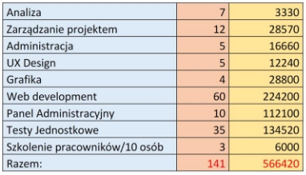

3. Diagram otoczenia biznesowego 

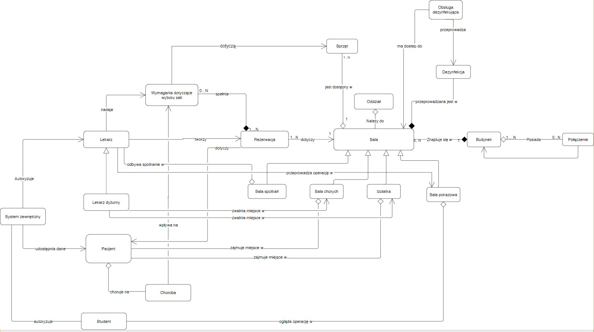

4. Aktorzy 

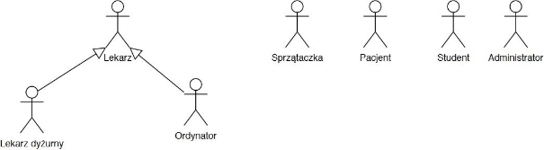

5. Wymagania formalne 

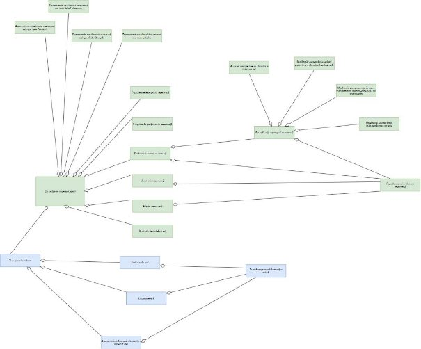

2. Etap II – diagram przypadków użycia, scenariusze i projekt GUI 
1. Diagram przypadków użycia 

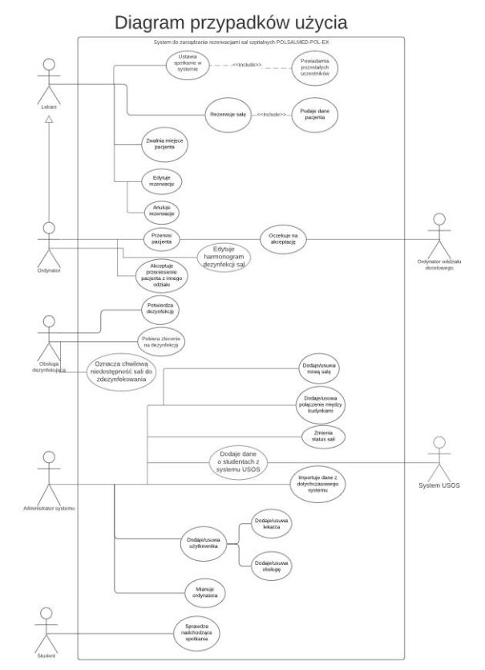

2. Scenariusze 

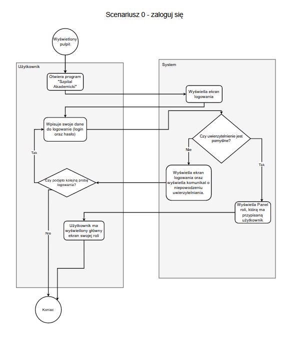

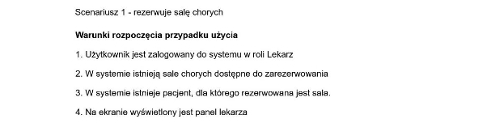

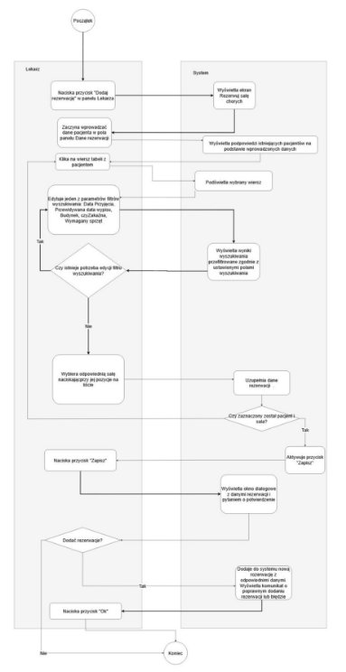

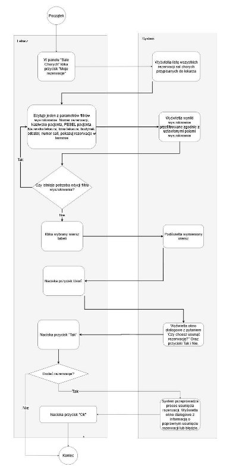

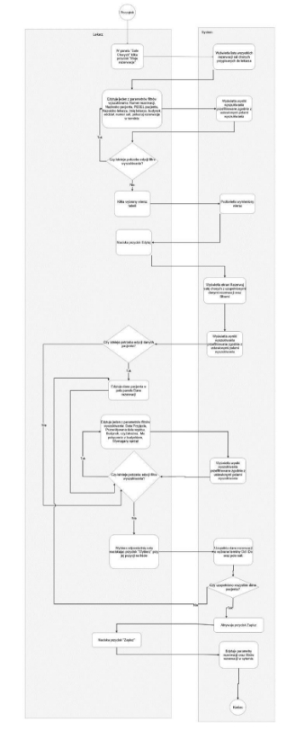

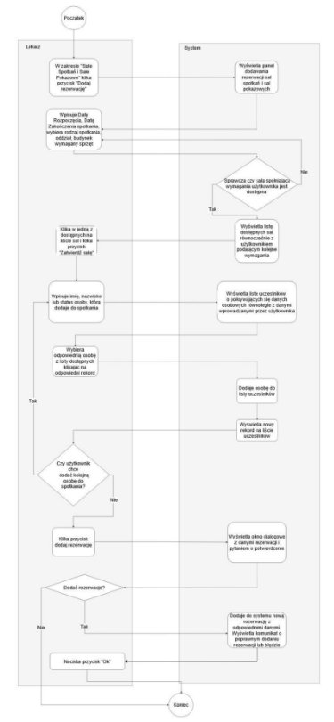

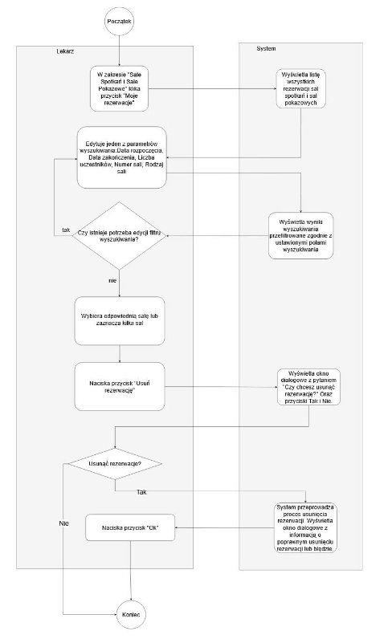

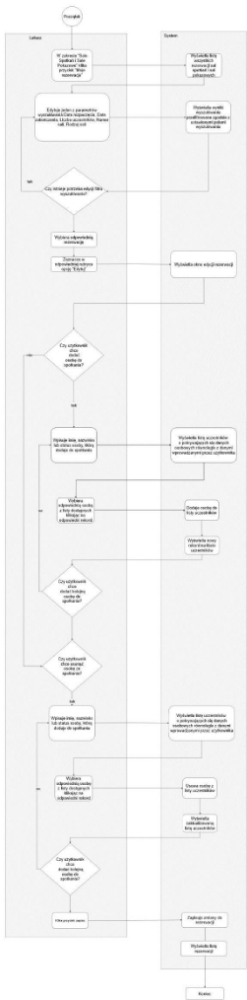

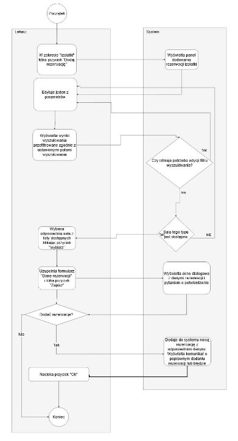

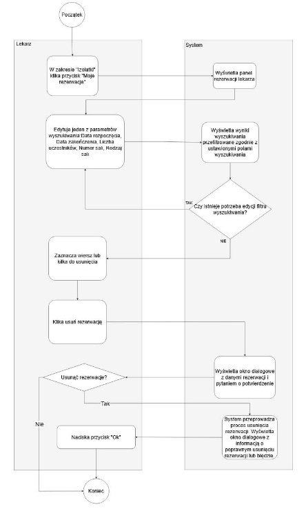

3. Diagram GUI 

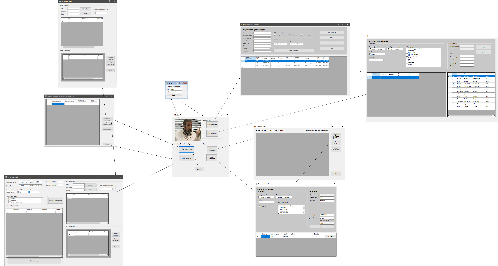

3. Etap III – diagram klas i diagram sekwencji 
1. Diagram klas 

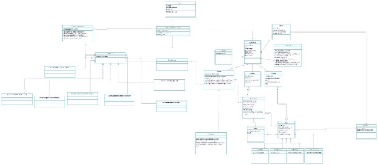

2. Diagramy sekwencji 

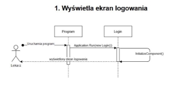

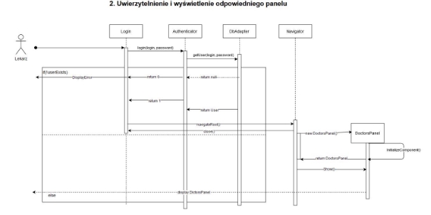

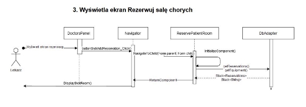

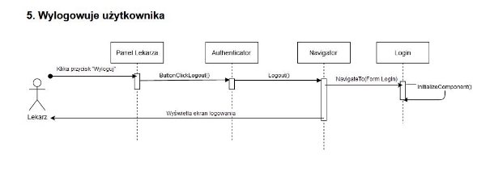

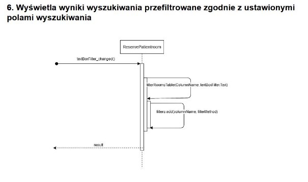

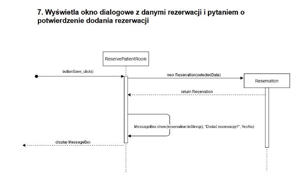

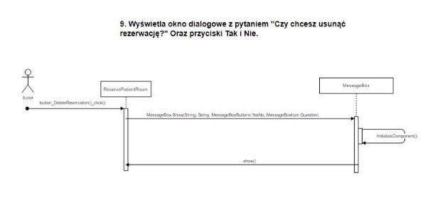

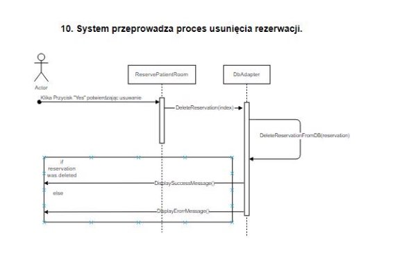

